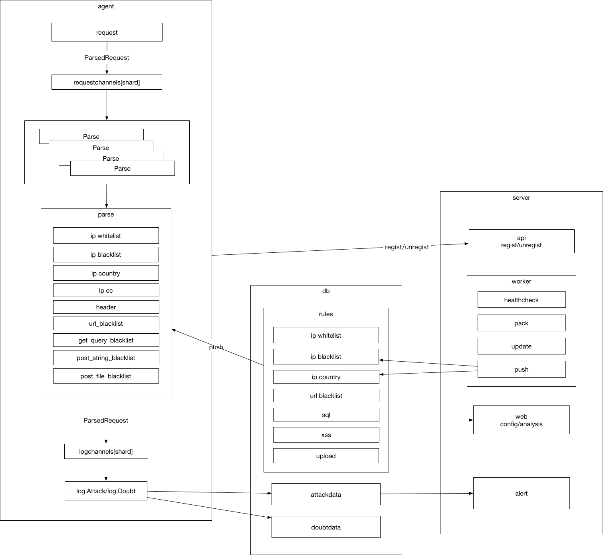

Heimdall
===

Heimdall can see all http requests send to nginx.

Heimdall will not block requests. It only parse request on sideway. You can use nginx_mirror_module or any other methods to send your http requests to Heimdall agent mirror port. Agent will parse request by following rules you configured in web interface. Dangerous requests will be send to server side and store into mongodb. Attach requests will cause an alert. You can manage the whole system on web interface.

Heimdall is about to help find how hacker attacks your website or api. By knowing how, you can easily fix your hole.

